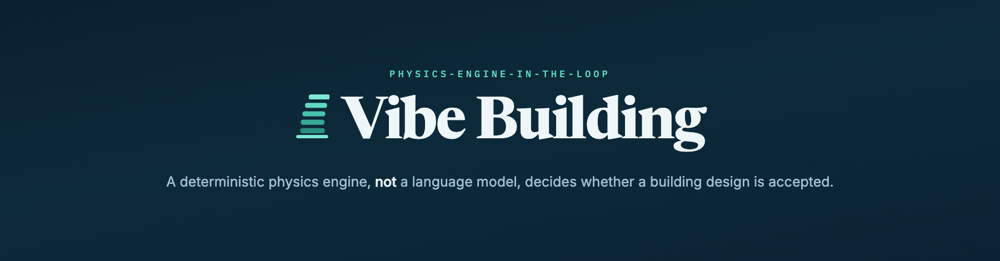
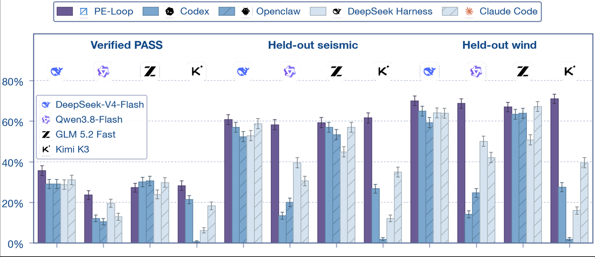
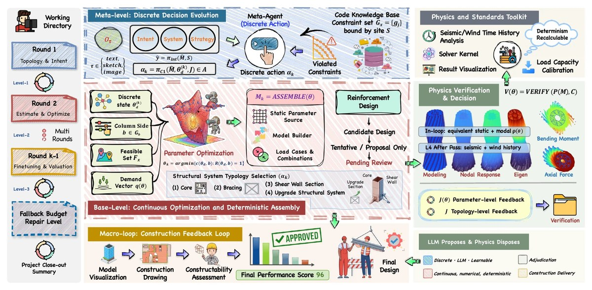
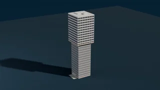
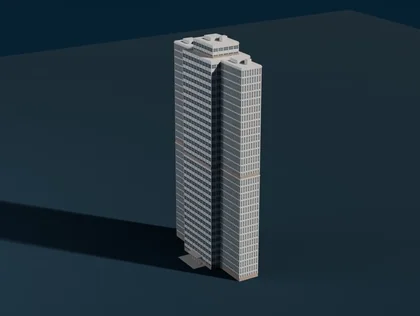
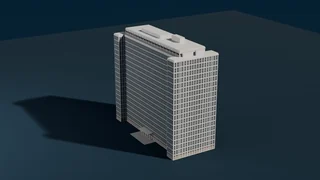
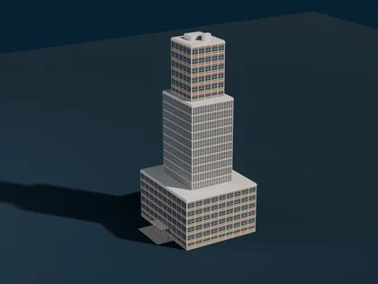
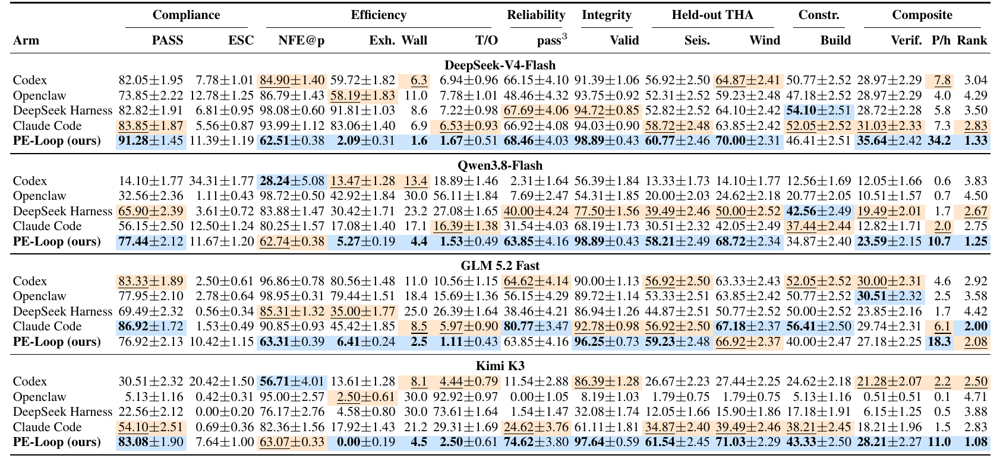

<div align="center">



[**Yongqing Jiang**](https://yongqingjiang.com/)<sup>1&dagger;</sup> &middot; [**Haoran Luo**](https://haoranluo.net/)<sup>1*</sup> &middot; [**Jianze Wang**](https://scholar.google.com/citations?user=ErWzJ4cAAAAJ&hl=zh-CN)<sup>2</sup> &middot; [**Xin Zhou**](https://scholar.google.com/citations?user=YpEaYXkAAAAJ&hl=en)<sup>1</sup> &middot; [**Kaoshan Dai**](https://www.researchgate.net/profile/Kaoshan-Dai-2)<sup>2</sup> &middot; [**Zhiqi Shen**](https://scholar.google.com/citations?user=EA2T_lwAAAAJ&hl=en)<sup>1*</sup>

<sup>1</sup>Nanyang Technological University&emsp;&emsp;&emsp;&emsp;<sup>2</sup>Sichuan University

&dagger;project leader&emsp;*corresponding authors

[](https://arxiv.org/abs/2610.08156)
[](https://jovanqing.github.io/Vibe-Building/)
[](https://jovanqing.github.io/Vibe-Building/paper.pdf)
[](#release-plan)
[](#release-plan)

[[`arXiv`](https://arxiv.org/abs/2610.08156)]
[[`Project page`](https://jovanqing.github.io/Vibe-Building/)]
[[`Paper`](https://jovanqing.github.io/Vibe-Building/paper.pdf)]
[[`BibTeX`](#citation)]

</div>

This work introduces the **Vibe Building** task and **PE-Loop**, an agent in which a deterministic
physics engine, not a language model, decides whether a building design is accepted. The language
model proposes discrete revisions and pays nothing for them; the physics engine holds the verdict
and every decision costs one evaluation of the budget.



> [!NOTE]
> This repository is the landing page for the paper. **The code and VB-Bench are not public yet.**
> See [Release plan](#release-plan) for what is coming and in what order. Watch or star the
> repository to be notified.

## News

- **2026-10-06** &nbsp;Preprint on arXiv: [arXiv:2610.08156](https://arxiv.org/abs/2610.08156)
- **2026-10** &nbsp;Project page is live, with twenty-six buildings carried end to end through the pipeline: [jovanqing.github.io/Vibe-Building](https://jovanqing.github.io/Vibe-Building/)
- **2026-10** &nbsp;Paper submitted. The PDF is available from the project page.

## TL;DR

Most agents that design buildings produce models that look plausible but are never checked
against mechanics or against code. We introduce the **Vibe Building** task and **PE-Loop**
(Physics-Engine-in-the-Loop), an agent in which a deterministic physics engine is the only
source of evaluation signal. The language model proposes discrete revisions and pays nothing
for them. The physics engine decides, and every decision costs one evaluation of the budget.
Replacing that verdict with a language-model judge, with everything else held fixed, leaves
**58.43%** of accepted designs noncompliant.

## Abstract

Automated building design must comply with seismic and wind codes and satisfy structural
mechanics constraints, yet most existing agents produce visually plausible models without
verification grounded in mechanical analysis and code compliance. We introduce the Vibe
Building task and propose PE-Loop (Physics-Engine-in-the-Loop), an agent in which a
deterministic physics engine is the sole source of evaluation signals, mapping code
constraints to a physics process reward, while the language model is confined to proposing
discrete revisions (section menu, topology, and lateral system). Designs are verified by
held-out seismic and wind time-history checks and a constructability gate. On VB-Bench,
3,577 physics-adjudicated building instances across six code families, PE-Loop achieves the
highest verified success rate under three of four backbone LLMs, the highest held-out seismic
pass rate under all four, and the highest held-out wind pass rate under three. Replacing the
physics verdict with a language-model judge, all else fixed, leaves 58.43% of accepted designs
noncompliant. These results suggest that reliable structural design rests less on a stronger
LLM proposer than on an adjudicator the proposer cannot influence, a division of labor for
agents whose outputs must hold up in the physical world.

## Method

<div align="center">

</div>

The meta level evolves discrete decisions (intent, system, strategy). The base level runs
continuous optimisation and deterministic assembly. Physics verification returns
parameter-level and topology-level feedback. The loop terminates only when every strength and
serviceability constraint holds.

## What the pipeline produces

Every model below was produced by the pipeline and rendered by the same Blender scene, from four
structural typologies that do not appear on the project page. The project page carries the other
twenty-two, each with its Rhino massing, its OpenSeesPy frame and its first mode shape.

<div align="center">

| | |
| :---: | :---: |
| <br>**Brutalist Castle Keep Tower** · 106 m<br>top-heavy overhang on a slender shaft | <br>**Diamond Slab Tower** · 127 m<br>slab tapering to a point at both ends |
| <br>**Brutalist Mega-Slab Residential** · 59.5 m<br>long slab lifted on pilotis | <br>**Art Deco Stepped Tower** · 84 m<br>setbacks narrowing toward the crown |

[**See all twenty-six, with the full four-stage pipeline →**](https://jovanqing.github.io/Vibe-Building/#demos)

</div>

## Results

### Main table

Five agent systems run under four backbone LLMs on the topology-decision instances of the main
split, at effort tier `high`. Every arm receives the same instances, the same margin oracle and
the same budget, so the only thing that varies is the system. Within each block the best value
per column is shaded blue and the second orange, and tied values share a mark. Lower is better
for NFE@p, Exh., Wall, T/O and Rank; ESC is reported but not ranked.



<details>
<summary><b>Column glossary</b> (the paper gives full definitions and denominators in Appendix E)</summary>

| Column | Meaning |
| --- | --- |
| **PASS** | In-loop compliance: the design satisfies every strength and serviceability constraint. |
| **ESC** | Escaped: answers that left the loop without a verdict. Reported, not ranked. |
| **NFE@p** | Number of function evaluations spent to reach a pass. Lower is cheaper. |
| **Exh.** | Budget exhausted without a pass. |
| **Wall** | Wall-clock minutes per instance. |
| **T/O** | Timed out. |
| **pass³** | Passes on all three seeds of the same instance. Stability under resampling. |
| **Valid** | Answer is a well-formed, parseable design. |
| **Seis. / Wind** | Held-out time-history analysis: seismic and wind records never seen in the loop. |
| **Build** | Constructability gate. |
| **Verif.** | Certified success: passes every gate above, including both held-out checks. |
| **P/h** | Passes per hour. Throughput. |
| **Rank** | Mean rank across the ranked columns within the block. |

±&nbsp;is the Agresti–Coull standard error (standard error of the mean for NFE@p). Wall is in
minutes, P/h in passes per hour, every other column in percent. PASS, Seis., Wind, Build and
Verif. are over the 390 topology-decision answers per arm; ESC, Exh., T/O and Valid over all 720
answers; pass³ over the 130 instances.

</details>

### Who holds the verdict

The verdict is handed to a language-model judge that sees the brief, the code limits and the
design parameters but no simulator output. Everything else is fixed (Table 5 of the paper).

| Acceptance gate | Self-rep. PASS % | Verified PASS % ↑ | False-pos. % ↓ | Wasted NFE % ↓ | Jaccard ↑ | Wall s |
| --- | ---: | ---: | ---: | ---: | ---: | ---: |
| **Margin oracle (ours)** | 77.78 | **77.78** | **0.00** | **0.00** | 1.00 | 110.8 |
| LLM judge (same LLM) | 49.44 | 20.56 | 58.43 | 44.41 | 0.31 | 238.4 |
| LLM judge (stronger, disjoint) | 40.00 | 17.22 | 56.94 | 45.19 | 0.29 | 342.8 |

The two zeros on the first row are zero *by construction*, not for want of data: the gate of
the margin oracle is the physics check itself, so what it reports and what verification
confirms are the same quantity.

### Swapping the backbone

Because the verdict never depends on the proposer, the held-out pass rate barely moves when
the language model behind it changes. Spread across DeepSeek-V4-Flash, Qwen3.8-Flash,
GLM 5.2 Fast and Kimi K3:

| | PE-Loop | Best baseline |
| --- | ---: | ---: |
| Held-out seismic | **3.3 pp** | 23.8 pp |
| Held-out wind | **4.1 pp** | 27.7 pp |

### VB-Bench

3,577 physics-adjudicated building instances, 1,311 gradable tasks, six code families
(GB, EC8, ASCE 7, BSL, IS, NZS). Every code limit is traceable to the clause it comes from.

## Release plan

Ordered against the [ML Code Completeness Checklist](https://github.com/paperswithcode/releasing-research-code).
Nothing below is public yet; this section is the roadmap, and it is updated as items land.

- [ ] **VB-Bench instances** and the physics adjudication harness
- [ ] **PE-Loop** agent code (meta level, base level, margin oracle)
- [ ] **Structural-code knowledge base**: 86 codes, 625 cross-linked entries with clause provenance
- [ ] **Evaluation code** and the scripts that reproduce every table and figure in the paper
- [ ] **Held-out record libraries**: 44 FEMA P-695 far-field motions, 16 wind series
- [ ] **Pipeline exporters**: Rhino, Blender and OpenSeesPy artefacts shown on the project page

Release is gated on the review outcome. Opening an issue to ask about timing is welcome.

## What is in this repository today

This page, the figures above and four turntable animations. The other twenty-two buildings,
the full four-stage pipeline for each, and every experimental figure live on the
[project page](https://jovanqing.github.io/Vibe-Building/), which is built from the same
artefacts a pipeline run produces. No code, no model weights and no benchmark data are here yet.

## Citation

```bibtex
@article{jiang2026vibebuilding,
  title   = {Vibe Building},
  author  = {Jiang, Yongqing and Luo, Haoran and Wang, Jianze and
             Zhou, Xin and Dai, Kaoshan and Shen, Zhiqi},
  journal = {arXiv preprint arXiv:2610.08156},
  year    = {2026},
  doi     = {10.48550/arXiv.2610.08156}
}
```

## Acknowledgements

The analysis core is built on [OpenSeesPy](https://github.com/zhuminjie/OpenSeesPy).
Geometry and rendering use [Rhino](https://www.rhino3d.com/) and [Blender](https://www.blender.org/).
The held-out seismic library draws on the FEMA P-695 far-field set and the PEER NGA-West2 database.

## Contact

Correspondence to [yong.qingjiang@outlook.com](mailto:yong.qingjiang@outlook.com).

## License

Not yet determined. A license will be stated when the code and VB-Bench are released. Until
then no license is granted for the contents of this repository.
